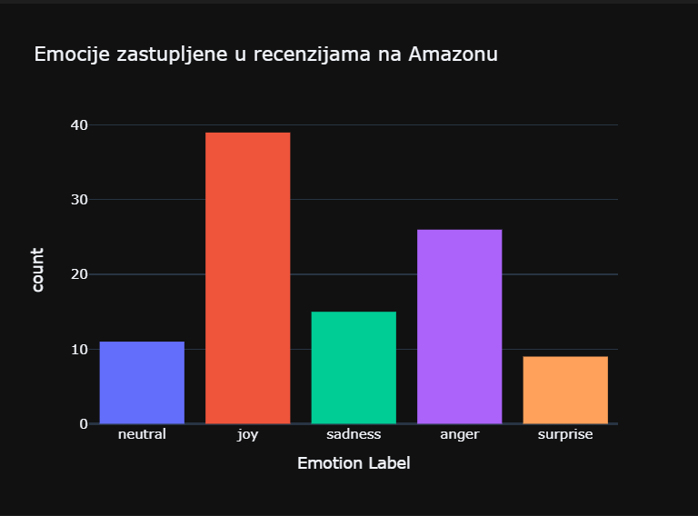

# Model za analizu sentimenata koji može da identifikuje emocije koje se prenose u datom tekstu

## 1. Uvod
 Koristeći napredne algoritme i tehnike obrade prirodnog jezika, model analize sentimenata može efikasno identifikovati i analizirati sentimente izražene unutar teksta.
 Uključuje analizu riječi i fraza korištenih u tekstu kako bi se odredilo osnovno osjećanje, bilo da je pozitivno, negativno ili neutralno.

 Analiza sentimenata ima brojne praktične primjene. Istraživači i pojedinci mogu dobiti dublje razumjevanje javnog mišljenja, donositi informisane odluke i prilagoditi svoje strategije kako bi bolje rezonovale sa svojom ciljnom publikom.

## 2. Dataset
Dataset koji se koristio za ovaj projekat sadrži 4000 hiljade različitih recenzija sa Amazona.

## 3. Predprocesiranje teksta
Predprocesiranje teksta je ključni korak u analizi sentimenata, jer olakšava obradu i analizu teksta. Tokom analize sentimenata vršena je tokenizacija, uklanjanje stop-riječi i lematizacija izvornog teksta.

## 4. Analiza sentimenata u tekstu
Python je popularan programski jezik koji se koristi za analizu teksta, a biblioteka Natural Language Toolkit (NLTK) je jedna od najčešće korištenih biblioteka za obradu prirodnog jezika u Python-u.

U okviru ovog projekta korištene su biblioteke kao što su pandas za rukovanje podacima, nltk za obradu prirodnog jezika i objekat klase SentimentlntensityAnalyzer za analizu sentimenta.
 
## 5. Identifikacija emocija u tekstu
Prilikom analize emocija korištena je biblioteka transformers. Pomoću pipline objekta iz biblioteke transformers je preuzet prethodno obučeni model koji analizira tekst i klasifikuje ga u 7 kategorija: ljutnja, zgroženost, strah, radost, ravnodušnost, tuga i iznenađenost. 

## 6. Grafički prikaz 
Naredni dijagram prikazuje koje emocije ovladavaju u okviru 100 recenzija sa Amazona:
